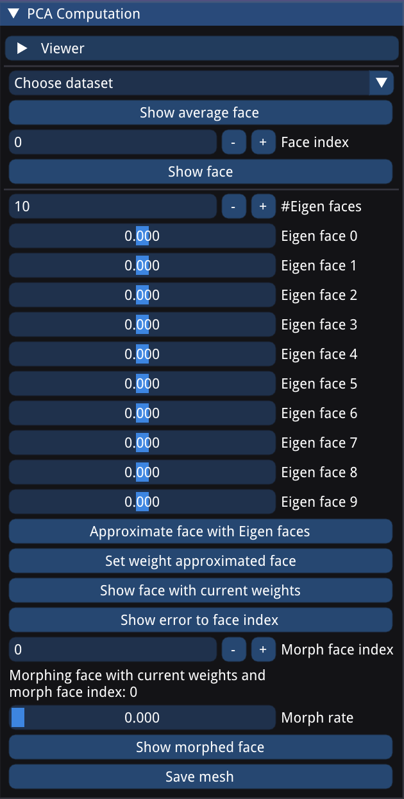
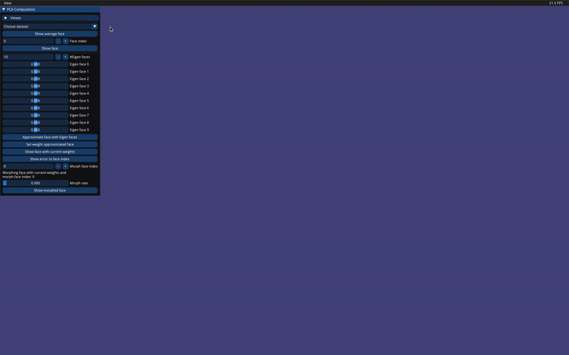
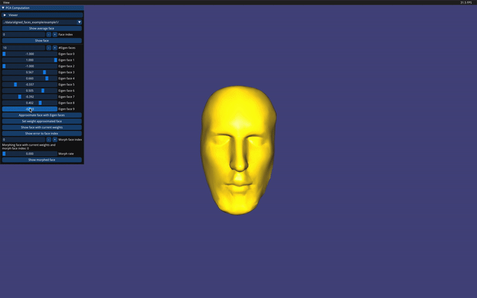
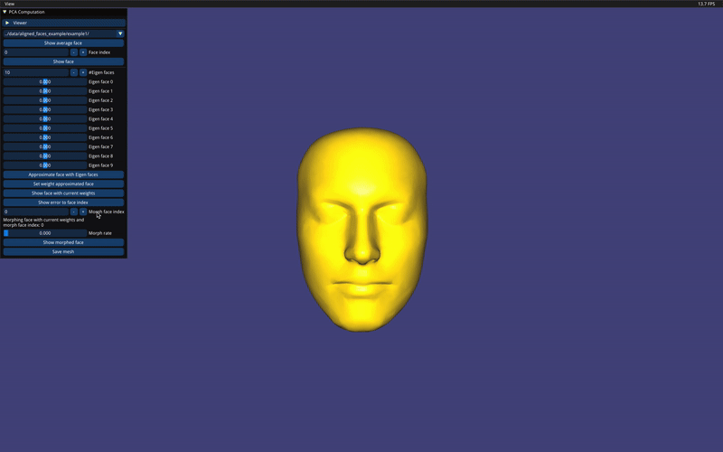

# SMGP-2021 - Group 1
## Shape modeling and geometry processing project

Get the all_data folder from https://polybox.ethz.ch/index.php/s/lRKp9AjerxiQSzC
Put all folders in the all_data.zip into the data folder (if you are confused, look at the gitignore)

# Assignment 6 - Report

## Report - Landmark selection
Worked on by:

### filename / descriptive title / etc.

## Report - Rigid face alignment
Worked on by:

### filename / descriptive title / etc.

## Report - Non-rigid face alignment
Worked on by:

### filename / descriptive title / etc.

## Report - PCA of faces
Worked on by: Clemens, Nicolas

To solve this task, we gather a dataset of faces in a data structure. We proceed by computing the mean face and use it to compute the offset between this mean face and each face in the data set. Then, we construct a matrix A where each column represents one of these offsets. We construct the covariance matrix using Matrix A as described in [1] to significantly reduce computation time, and subsequently compute the PCA from which we can reconstruct the most dominant Eigen vectors of our dataset. To most accurately represent the original faces using those Eigen faces, we compute the dot product between the offset, and the Eigen faces to compute the weight for each Eigen face. Using these weights we can reconstruct the original faces through a linear combination of all Eigen faces scaled by those weights added to the mean face. We continued with the implementation of a morphing mechanism which is computed by linearly interpolating offsets (linear combinations of Eigen faces) of two faces and adding them to the mean face. This enables morphing from one face to another. (Clemens, Nicolas)

[1]: Matthew Turk and Alex Pentland. 1991. Eigenfaces for recognition. J. Cognitive Neuroscience 3, 1 (Winter 1991), 71–86. DOI:https://doi.org/10.1162/jocn.1991.3.1.71

## Report for UI
Worked on by: Whole group (most credit goes to Pascal)

### PCA UI
The UI supports the adjustment of the weights for each Eigen face and allows morphing between two faces. (Nicolas, Clemens) 

As additional features, we implemented:
<ul>
<li>
change the amount of Eigen faces used to approximate the original faces (Nicolas)
</li>
<li>
sliders for Eigen faces allowing to slide from the minimal weight of all original faces for each Eigen face to the maximal weight for reasonable adjustment of each weight, but still providing a big enough space to explore features (Nicolas) 
</li>
<li>
a function to show the error between the shown and the original face (Nicolas, Pascal)
</li>
</ul>

### Screenshot of the user interface used to adjust PCA parameters

<ul>
<li>
The PCA user interface starts with the general viewer settings (we assume these settings are well known).
</li>
<li>
"Choose data": It provides a dropdown to choose the dataset from for easy dataset selection.
</li>
<li>
"Show average face": It shows the mean face of the dataset. Since it is no face available in the dataset the face index below will be set to -1.
</li>
<li>
"Face index": The face index interface allows to decrease/increase the face index and scroll through each face in the dataset.
</li>
<li>
"Show face": It shows the currently selected face from the dataset should any other mesh have been displayed in the mean time.
</li>

<li>
"#Eigen faces": The next integer input allows the user to adjust the amount of Eigen faces used to adjust the face offset computed through a linear combination of all Eigen faces weighted with the chosen weight in the range [-1,1]. The weights of each Eigen face can be adjusted through the listed sliders starting at Eigen face 0.
</li>
<li>
"Approximate face with Eigen faces": It shows the original face approximated using the Eigen faces with weights chosen to minimize the distance.
</li>
<li>
"Set weight approximated face": It set the weights chosen by the above sliders according to the current face index and tries to approximate it as close as possible. 
</li>
<li>
"Show face with current weights": This button lets you display the mean face with a linear combination of Eigen faces weighted according to the weight specified using the sliders for each Eigen face. 
</li>
<li>
"Show error to face index": This displays a coloured visualization of the distance between the computed offset using a linear combination of the Eigen faces added to the mean face and the face chosen by the face index.
</li>

<li>
"Morph face index": Specifies the face index of a face from the dataset which we will morph with the linear combination of Eigen faces currently chosen.
</li>
<li>
"Morph rate": This scalar lets the user linearly interpolate between the two faces chosen for the morph process.
</li>
<li>
"Show morphed face": This button lets the user display the result of the morph process should any other mesh have been displayed in the mean time.
</li>
<li>
"Save mesh": This button lets the user save the displayed mesh to the folder "data/pca-results".
</li>

</ul>

